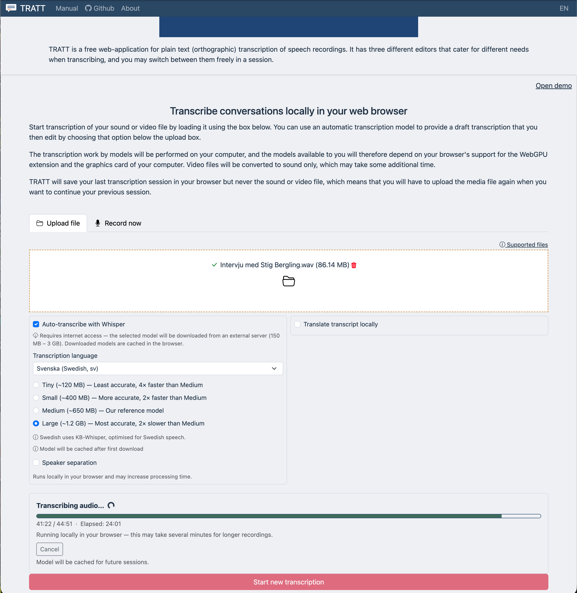
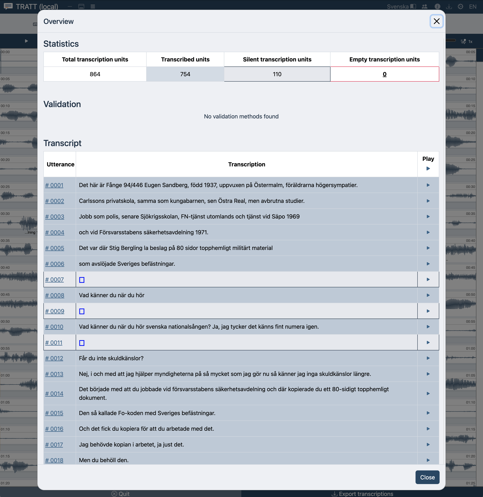
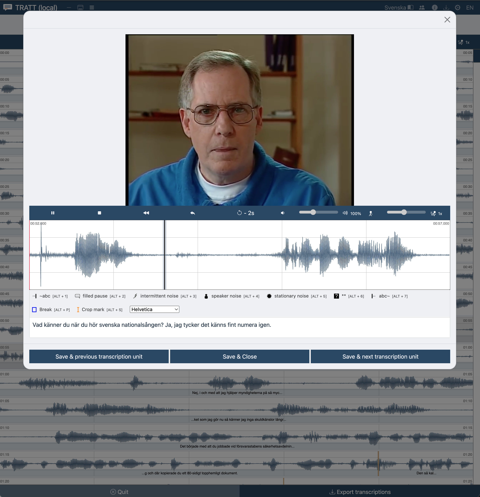

# TRATT — a Visible Speech tool for orthographic transcription

[](https://github.com/humlab-speech/TRATT/actions/workflows/osv-scanner.yml)
[](https://github.com/humlab-speech/TRATT/actions/workflows/codeql.yml)
[](https://github.com/humlab-speech/TRATT/actions/workflows/semgrep.yml)
[](https://github.com/humlab-speech/TRATT/actions/workflows/njsscan.yml)

TRATT supports the user to perform plain text (orthographic) annotation of the content of an interview,
monologue, text reading, or any other form of spoken communication act safely and securly in a web browser. Once the app has been opened for the user to interact
with, no communication to external server is performed by the app, and the user can securly use the app to perform the annotation even of the most sensitive interviews or conversations without risk of  
leaking the speech recording to outside parties.

The user can also take advantage of automatic transcription of the audio recording. A speech recognition model will then be downloaded to the user's computer and applied locally to the recording to produce a draft text output. Since the model is run locally on the user's computer, the speed of transcription and also what model sizes (model accuracies) are available will depend on the computers' specifications. Most important is a decent graphics card.

Once automatic draft transcription have been performed, TRATT will open the transcript in it's editor views and allow the user to manually edit the transcriptions.
The user can upload most audio and video formats to TRATT, and the application will make the audio seamlessly available for the user to work with in the application. If the user uploads a video format that directly supported by the browser (MP4 has the broadest browser support currently, and webm is also a well-supported format), then the app will display the portion of the video with the audio playback when making detailed edits in the popup editor.

## Editors:

TRATT supports different editors that you can choose according to your preferences. You can also switch between these easily while you are working on the same task.

- 2D-Editor: This editor breaks the whole view of the signal to pieces and shows the pieces as lines one after one. Here you can set boundaries und define segments too.
- Dictaphone Editor: An typical, easy-to-use editor with just a texteditor and an audioplayer.
- Linear-Editor: This editor shows two signaldisplays: One for the whole view of the signal and one as loupe. You can set boundaries and define segments.

## Some images of the user interface

### The landing page of the application




### The work views inside the application






### Export of transcriptions to a file on your computer


# User Manual

TRATT has its own manual in [`docs/manual/`](docs/manual/index.md).

- **New here?** [Quick start — your first transcription](docs/manual/quick-start.md)
- **Transcribing every day?** [How transcribing works](docs/manual/transcribing.md) and the [keyboard shortcuts](docs/manual/shortcuts.md)
- **Handling sensitive recordings?** [What leaves your computer](docs/manual/privacy.md)
- **Arriving from the upstream docs?** [Coming from the OCTRA manual](docs/manual/coming-from-octra.md)

The manual is published in **English** and **Swedish**, with a language switcher on every page:

- English — <https://humlab-speech.github.io/TRATT/manual/>
- Svenska — <https://humlab-speech.github.io/TRATT/manual/sv/>

The Markdown sources are the manual: `docs/manual/*.md` is English, `docs/manual/sv/*.md` is
Swedish. Every push to `main` renders them to a static site and publishes it alongside the
typedoc API documentation at the root of that site (`.github/workflows/main.yml`). The app links
to the manual in whichever language its interface is set to.

```bash
npm run validate:manual   # every link, anchor and in-app deep link resolves
npm run build:manual      # renders docs/manual to dist/manual
```

The app links to the published site through `tratt.manual.url` and `tratt.manual.pageExtension`
in `apps/tratt/src/config/appconfig.json`, so a deployment that hosts the manual elsewhere only
changes its configuration file. See [`docs/manual/CONTRIBUTING.md`](docs/manual/CONTRIBUTING.md)
for the conventions and the anchor contract between the app and the manual.

The [OCTRA manual](https://clarin.phonetik.uni-muenchen.de/apps/octra/manuals/octra/) remains
the better reference for the parts TRATT inherited unchanged — the AnnotJSON data model, and the
structure of guidelines, validation and project configuration files.

## Features in detail

- Three different editors
- Noise markers (placeholders) in the form of icons in text. Icons can be UTF-8 symbols, too.
- Auto-saving of the transcription progress to prevent data loss
- Import/Export support for various file formats like AnnotJSON, Textgrid, Text, Table and more.
- Validation using project specific guidelines in connected mode
- Shortcuts for faster transcriptions
- Multi-Tiers support in local mode
- Logging of user activities for further studies
- Localization of the GUI
- Customization with configuration files for the app, project, guidelines and validation methods.
- Segment boundaries as markers in text
- Overview window to see the whole transcript
- Costom table generator
- Automatic draft transcription
- Support most audio and video file formats
- Video content may also be displayed in the detailed editor if the format is fully supported by the browser.

# Remarks on this fork of the OCTRA tool

TRATT is a fork of [OCTRA](https://github.com/IPS-LMU/octra), developed at the Institute of Phonetics and Speech Processing, LMU Munich. TRATT serves the particular needs of the Visible Speech speech research platform and the aim of [Språkbanken CLARIN](https://sprakbanken.se/om-oss/organisation-och-verksamhet/sprakbanken-clarin) and [Humlab](https://www.umu.se/humlab/) at Umeå University to support more efficient work on
interview materials and other forms of spoken conversation recordings in a safe and efficient manner. Therefore, TRATT supports less of OCTRA's advanced features that relate to the OCTRA backend research platform, and if this kind of connectivity is the reason for your interest, we suggest that you use [the original OCTRA](https://github.com/IPS-LMU/octra) instead.

### Upstream OCTRA website

Please visit the [repository and pages](https://github.com/IPS-LMU/octra) of the original OCTRA tool for up to date news on upstream development.

If you don't want to install OCTRA yourself, you can use its latest upstream release [here](https://clarin.phonetik.uni-muenchen.de/apps/octra/octra/).

### Affiliations

TRATT

[Språkbanken CLARIN](https://sprakbanken.se/om-oss/organisation-och-verksamhet/sprakbanken-clarin)
[Humlab at Umeå University](https://www.umu.se/humlab/)

OCTRA (upstream)

[INSTITUTE OF PHONETICS AND SPEECH PROCESSING](http://www.en.phonetik.uni-muenchen.de/)
