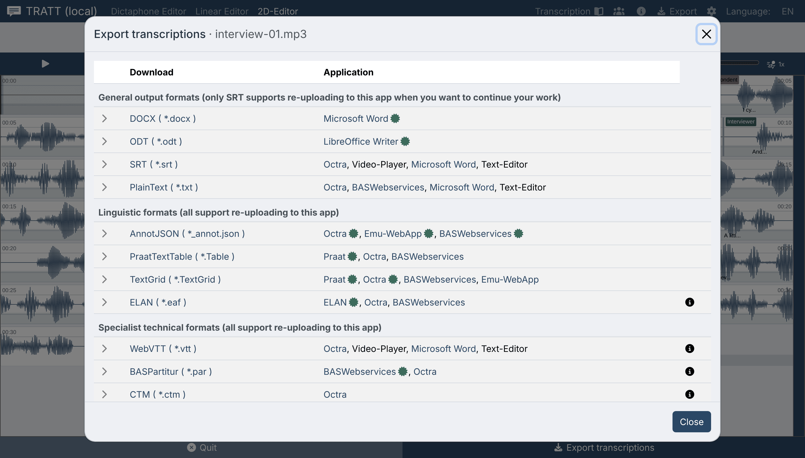

# Exportera

**För:** alla, i slutet av varje arbetspass.

TRATT håller ditt arbete i webbläsaren, inte på disk. **Att exportera en fil är
det enda sättet ditt transkript lämnar webbläsaren.** Gör det innan du slutar,
varje gång.

Klicka **Exportera** (nedladdningsikonen i den övre listen, eller knappen längst
ned i redigeraren). Dialogen heter *Exportera transkriptioner*. Klicka på ett
format för att fälla ut dess alternativ, och sedan på **Ladda ner**.

---

## Vilket format?

Dialogen delar in formaten i tre avsnitt och talar om för varje grupp om filen kan
läsas tillbaka in i TRATT.

### Allmänna utdataformat

För att läsa, dela och publicera. **Bara SRT kan läsas tillbaka in i TRATT.**

| Format | Fil | Bra för |
| --- | --- | --- |
| **DOCX** | `.docx` | Word. Det format de flesta faktiskt vill ha transkriptet i. |
| **ODT** | `.odt` | LibreOffice / OpenOffice. Samma alternativ som DOCX. |
| **SRT** | `.srt` | Undertexter, videospelare, och det enda formatet i gruppen som går att importera igen |
| **PlainText** | `.txt` | Allt som läser text |

### Lingvistiska format

Alla dessa kan läsas tillbaka in i TRATT.

| Format | Fil | Bra för |
| --- | --- | --- |
| **AnnotJSON** | `_annot.json` | **TRATT:s eget format.** Behåller allt: nivåer, gränser, talare, markörer. Exportera det vid sidan av vad du annars behöver. |
| **TextGrid** | `.TextGrid` | Praat |
| **ELAN** | `.eaf` | ELAN. Lägg `.eaf`-filen i samma mapp som ljudet, annars hittar ELAN inte mediet. |
| **PraatTextTable** | `.Table` | Praats tabellformat |

### Specialiserade tekniska format

| Format | Fil | Bra för |
| --- | --- | --- |
| **WebVTT** | `.vtt` | Undertexter för webbvideo |
| **BASPartitur** | `.par` | BAS-webbtjänsterna. Exporten skriver ORT- och TRN-rader ur transkriptionen. |
| **CTM** | `.ctm` | Verktyg för utvärdering av taligenkänning. Konfidensvärdet skrivs alltid som 1. TRATT håller inte reda på det. |

> **Ta alltid en AnnotJSON-kopia.** DOCX och ODT är enkelriktade: de läses bra och
> importeras illa. Kan du behöva rätta transkriptet om ett halvår är det
> AnnotJSON-filen plus originalinspelningen som gör det möjligt.

---

## Alternativ

### DOCX och ODT

| Alternativ | Effekt |
| --- | --- |
| **Each sentence on a separate line** / **Continuous text** | En transkriptionsenhet per rad, eller allt sammanskrivet som löpande text |
| **Markera talar-ID i början av meningar** | Sätter talaretiketten först i varje enhet |
| **Add timestamp at beginning of each sentence** | Sätter starttiden först i varje enhet |
| **Collect annotations according to transcription tier in the output** | Visas när du valt fler än en nivå: grupperar utdata nivå för nivå i stället för att blanda |

### PlainText

| Alternativ | Effekt |
| --- | --- |
| **Markera talar-ID i början av meningar** | Som ovan |
| **Lägg till en radbrytning efter varje transkriptionsenhet** | En enhet per rad |
| **Separera transkriptionsenheter med läsbara tidsstämplar (HH:MM:SS.s)** | Läsbara tider mellan enheter |
| **Separera transkriptionsenheter med sampelpunkter** | Sampellägen mellan enheter, för att lägga texten mot signalen någon annanstans |
| **Collect annotations according to transcription tier in the output** | Visas när fler än en nivå är vald |

Markerar du båda tidsalternativen infogas båda.

### SubRip och WebVTT

| Alternativ | Effekt |
| --- | --- |
| **Move units with speaker label to separate levels** | En nivå per talare i stället för en blandad nivå |
| **Combine empty units with max duration (ms) between units of the same speaker** *(SRT)* | Slår ihop en kort lucka mellan två turer av samma person. Tomt stänger av det. |

### Att välja nivåer

Detta blir aktuellt först när ditt transkript har mer än en nivå.

- **AnnotJSON, TextGrid, PraatTextTable, ELAN** bär flera nivåer i sig själva och
  exporterar hela transkriptet. Inget val att göra.
- **SubRip, WebVTT, BASPartitur, CTM** rymmer en nivå och ber dig **Välj en nivå**.
- **DOCX, ODT och PlainText** visar **Select tiers to include** med en kryssruta
  per nivå. Alternativet *Collect annotations according to transcription tier*
  avgör sedan om utdata grupperas nivå för nivå eller blandas.

### Metadata

Dialogen erbjuder också de metadata som loggats medan du arbetade. De finns bara
om **Logga användaråtgärder** var på i Inställningar. Det är ett
forskningsmaterial (tangent- och uppspelningshistorik), inte en del av
transkriptet.

---

## Att exportera ett arkiv

En enda export täcker en hel omgång, och det är den enda export som kan läsas in
igen i sin helhet. **Exportera alla** i [Arbetsbänkens](workbench.md) fillista
öppnar **Exportera katalog**: markera de format du vill ha så skriver TRATT en
enda `.zip`.

Filen namnges efter vad den innehåller och när den gjordes, till exempel
`tratt_12_20261008@1923.zip`: tolv inspelningar, 8 oktober 2026, klockan 19:23 i
lokal tid.

Inuti har varje inspelning en egen mapp under `bundles/` som innehåller

- **källjudet** som du angav det,
- en förlustfri **`_annot.json`** av dess transkription, och
- de övriga format du markerat.

Två manifest i roten, **`manifest.json`** och **`manifest.csv`**, listar varje
inspelning med sökvägar och uppgifter. CSV-filen öppnas i ett kalkylprogram,
vilket gör den till ett behändigt register över en korpus.

Eftersom ljudet och AnnotJSON följs åt återställer ett släpp av arkivet på
släppytan hela omgången, med ljudet bifogat och transkriptionerna på plats. Att
läsa in det stänger av automatisk transkribering så att dina rättelser inte
skrivs över. Se [Arbetsbänken](workbench.md#loading-an-archive).

En inspelning vars ljud inte var bifogat vid exporten kan inte återställas ur
arkivet. TRATT talar om vilka under *Klar med varningar* i stället för att låta
hela exporten misslyckas.

> Det här är säkerhetskopian värd att ta. En mapp med DOCX-filer är en leverans;
> arkivet är det som gör att du kan ta upp arbetet igen.

---

## Format TRATT kan läsa

Släpp dessa tillsammans med ditt ljud på startsidan för att fortsätta ett
befintligt arbete.

| Format | Anmärkning |
| --- | --- |
| **TRATT-arkiv** (`.zip`) | En hel omgång, ljud och transkriptioner tillsammans. Se [Att exportera ett arkiv](#exporting-an-archive). |
| **AnnotJSON** (`_annot.json`) | Fullständig rundtur för en inspelning. Föredra detta. |
| **WhisperJSON** (`.json`) | Utdata från Whisper / WhisperX kört någon annanstans. Bara tidsstämplar och text läses; allt annat ignoreras. |
| **SubRip** (`.srt`) | Med alternativ för talarextraktion, se [Nivåer och talare](tiers-and-speakers.md#importing-material-that-already-has-speakers) |
| **WebVTT** (`.vtt`) | Läser `<v Namn>`-taggar. STYLE-, REGION- och NOTE-block ignoreras; flerradiga textblock slås ihop. |
| **PlainText** (`.txt`) | |
| **TextGrid** (`.TextGrid`), **PraatTextTable** (`.Table`) | |
| **ELAN** (`.eaf`) | Bara nivåattributet `ANNOTATION` tolkas |
| **BASPartitur** (`.par`) | TRN- och ORT-rader slås ihop till en nivå av tidsanpassade enheter |
| **CTM** (`.ctm`) | |

Transkriptfilens namn måste matcha ljudfilens namn, annars avvisar TRATT den med
*Transkriptfilens namn matchar inte ljudfilens namn*.

DOCX och ODT kan inte importeras. Inte heller Bundle JSON: det finns i koden men
export är avstängd.

---

## Egna tabeller

Har inget av ovanstående de kolumner du behöver, bygg din egen under **Egna
format** längst ned i exportdialogen. Se
[Verktyg → Tabellkonfiguratorn](using-tools.md#table-configurator).
