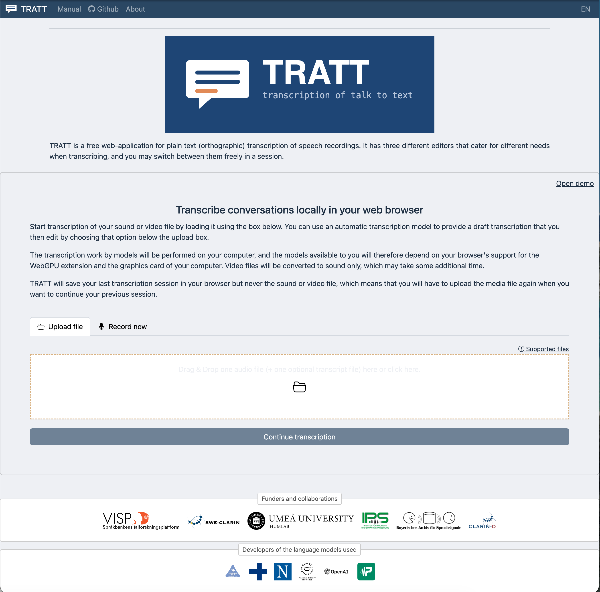
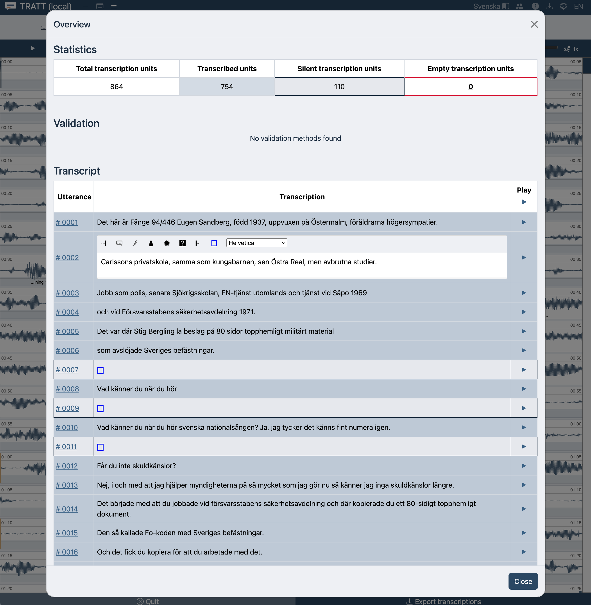
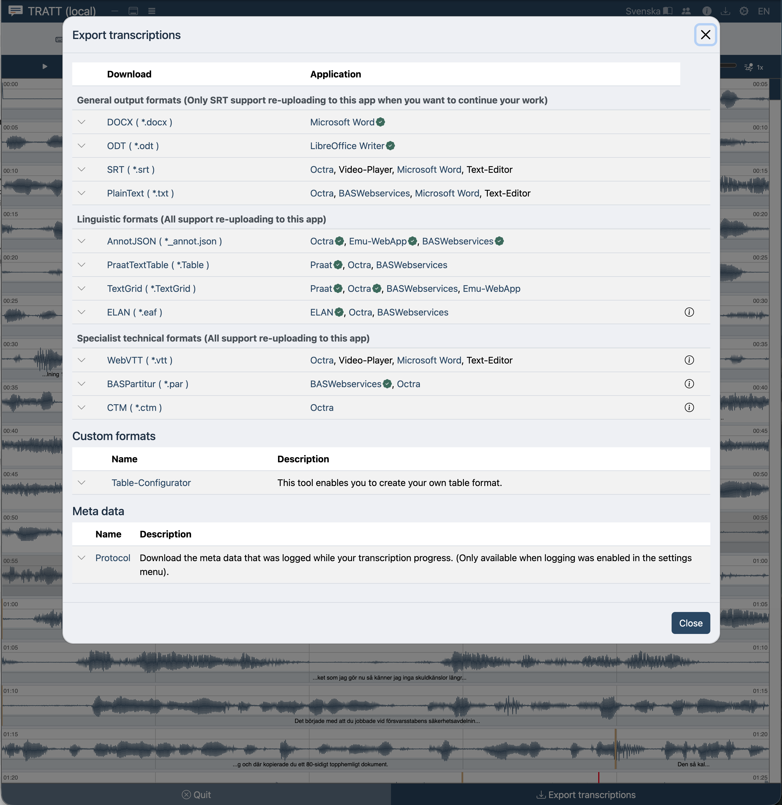

# Snabbstart: din första transkription

**För:** dig som just har öppnat TRATT och har en inspelning att transkribera.
**Du får:** ett rättat transkript sparat som en fil på din dator.
**Tid:** ungefär tio minuters uppmärksamhet. Använder du automatisk transkription
tillkommer tid för nedladdning och bearbetning, se steg 3.

Du behöver inget konto. Du behöver inte installera något.

---

## 1. Öppna TRATT

Du landar på en sida med rubriken **Transkribera samtal lokalt i din webbläsare**.

Använd **Chrome**, **Edge**, **Firefox** eller **Opera**. Safari fungerar för
manuell transkribering men kan inte köra automatisk transkription. Se
[Felsökning](troubleshooting.md#automatic-transcription-is-greyed-out).

## 2. Ladda in din inspelning

Stanna på fliken **Ladda upp fil** och dra din ljud- eller videofil till den
streckade rutan, eller klicka i rutan och välj filen.

De flesta format fungerar: `.wav`, `.mp3`, `.m4a`, `.flac`, `.ogg`, `.mp4`,
`.mov`, `.webm` med flera. Hela listan med storleksgränser finns under
[Ladda in en inspelning](loading-media.md#supported-file-formats).

En grön bock intill filnamnet betyder att TRATT har läst filen. En videofil tar
lite längre tid, eftersom ljudet först måste extraheras.

> **Har du ingen inspelning än?** Byt till fliken **Spela in nu** och spela in
> direkt i webbläsaren. Se
> [Spela in i webbläsaren](loading-media.md#recording-in-the-browser).

> **Bara nyfiken?** Länken **Öppna demo** uppe till höger i rutan laddar en
> exempelinspelning så att du kan prova utan eget material.

## 3. Bestäm om en modell ska skriva utkastet

När filen är inläst dyker en ruta upp under släppytan med kryssrutan
**Automatisk transkribering med Whisper**.

- **Lämna den omarkerad** om du vill skriva allt själv. Fortsätt till steg 4.
- **Markera den** så skriver en taligenkänningsmodell ett utkast som du sedan
  rättar. Välj **Transkriptionsspråk** och därefter en modellstorlek. Större
  modeller är noggrannare och långsammare, och första gången måste modellen
  laddas ned (ungefär 100 MB till 3 GB, den sparas i webbläsaren till nästa
  gång).

  Markera vid behov **Speaker separation** (talarseparation) så gissar TRATT vem
  som talar när. Vet du hur många personer som hörs, skriv antalet; för en
  intervju mellan två personer, skriv `2`.

Allt detta körs på din egen dator. Det enda som hämtas från internet är själva
modellen. Detaljer och rekommendationer:
[Automatisk utkasttranskription](automatic-transcription.md).

## 4. Starta

Klicka på knappen under rutan: **Starta ny transkription**.

Har du bett om ett utkast ser du nu förloppet: först modellnedladdningen, sedan
*Transkriberar ljud…* med en tidräknare, och därefter *Identifierar talare…* om
du valde talarseparation. För en lång inspelning tar det en stund; sidan måste
vara kvar öppen. När det är klart öppnas redigeraren av sig själv.

## 5. Rätta texten

Du hamnar i **2D Vy**: inspelningen ritas som en vågform på flera rader, en rad
efter den andra, med texten under varje talstycke.

TRATT kallar varje sådant stycke en **transkriptionsenhet**: ett yttrande,
ungefär en undertextrad. Andra verktyg kallar det ett segment.

Så här rättar du en enhet:

1. För muspekaren över den och tryck **Enter**. Ett fönster öppnas med just den
   enhetens ljud och text.
2. Tryck **Tabb** för att spela upp, **Tabb** igen för att pausa, **Esc** för att
   stoppa.
3. Rätta texten.
4. Tryck **Alt + →** för att spara och gå till nästa enhet, eller **Alt + ↓**
   för att spara och stänga fönstret.

Den slingan (Enter, Tabb, skriv, Alt + →) är hela arbetet. Allt annat är
finjustering.

Behöver du markera något som inte är ord (en paus, skratt, bakgrundsljud, ett
oförståeligt ord) använder du markörknapparna ovanför textfältet, eller
**Alt + 1** … **Alt + 7**. Se [Markörer](transcribing.md#markers).

Ditt arbete sparas fortlöpande i webbläsaren. Du behöver inte trycka spara.

## 6. Se över helheten

Tryck **Alt + 0** för att öppna **Översikt**. Den visar hur många enheter som
finns, hur många som har text, och hela transkriptet som en tabell. Klicka på en
rad för att redigera den där, eller på ▶ för att lyssna på den.

## 7. Exportera

Klicka på **Exportera**: nedladdningsikonen i den övre listen, och även en knapp
längst ned i redigeraren. Dialogen heter *Exportera transkriptioner*. Välj format
och klicka på **Ladda ner**.

Om du är osäker på vilket du vill ha:

| Du vill… | Välj |
| --- | --- |
| Läsa eller redigera transkriptet i Word eller LibreOffice | **Word (.docx)** eller **OpenDocument (.odt)** |
| Göra undertexter | **SubRip (.srt)** eller **WebVTT (.vtt)** |
| Kunna arbeta vidare i TRATT senare utan att förlora något | **AnnotJSON (`_annot.json`)** |
| Analysera i Praat eller ELAN | **TextGrid** eller **ELAN (.eaf)** |

Export till Word och OpenDocument kan lägga varje yttrande på egen rad eller köra
det som löpande text, och kan sätta talarnamn och tidsstämplar först. Alla
alternativ beskrivs under [Exportera](exporting.md).

---

## Två saker värda att veta innan du stänger fliken

**TRATT minns ditt transkript, men aldrig din inspelning.** När du kommer
tillbaka finns texten kvar, men du måste dra in samma mediefil igen för att
kunna arbeta vidare. Exportera en fil varje gång du slutar för dagen.

**Ingenting laddades upp.** Din inspelning stannade på din dator hela tiden. Se
[Vad lämnar din dator](privacy.md).

---

Vidare: [Så fungerar transkribering](transcribing.md) om du ska göra det här
ofta, eller [Tangentbordsgenvägar](shortcuts.md) om du bara vill bli snabbare.
