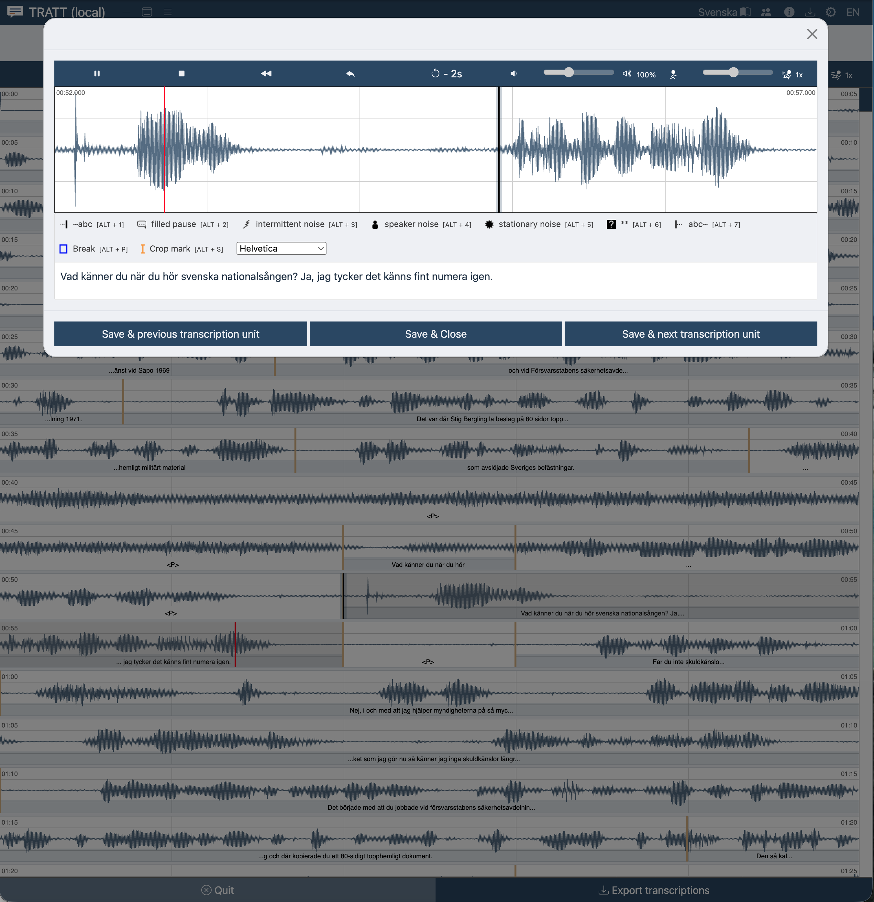

# The editors

**For:** anyone deciding how to work, or wondering why the screen looks different
from a colleague's.

TRATT offers several editors over the *same* transcript. Switching between them
changes nothing but your view; you can move between them mid-file, as often as you
like, using the buttons at the left of the top bar.

The default is the **2D-Editor**.

---

## 2D-Editor

The workhorse. The recording is drawn as a waveform broken into lines, like text
wrapping, with each transcription unit shaded and its text printed underneath.

**Use it when** you need to see and change where units begin and end, which is most
of the time.

- Hover a unit and press **Enter** to open the **transcription window** for it.
- **S**, **A**, **D** and drag-select manage boundaries directly on the waveform
  ([How transcribing works](transcribing.md#boundaries)).
- **Seconds per line** in Preferences controls how much audio each line holds.
- Turn on **Show magnifier** for a zoomed strip around the cursor when you need to
  place a boundary precisely.

### The transcription window

The pop-up you get with **Enter**. It shows one unit: its own waveform, a player,
the marker toolbar, and a text field.

- **Tab** / **Esc** play, pause and stop.
- **Alt + ←** and **Alt + →** save and step to the previous or next unit; this is
  the fastest way through a file.
- **Alt + ↓** saves and closes.
- **Ctrl/Cmd + S** cycles the speaker label.
- If your media file is one the browser can play natively (MP4, WebM), the video
  is shown next to the waveform.

---

## Dictaphone Editor

A player and a single text field. No waveform, no boundaries.

**Use it when** the recording is short, or the boundaries are already right and you
only want to type. It is also the gentlest starting point for someone who has never
used an annotation tool.

Playback keys are the same everywhere: **Tab** play/pause, **Esc** stop,
**Shift + Backspace** back to the last start position, **Shift + Tab** step back in
time.

---

## Linear Editor

Two signal displays stacked: the whole recording on top, and a magnified view of the
current position below.

**Use it when** you need fine control over boundary positions while keeping your
bearings in the file as a whole.

The two displays have separate playback keys, because you are usually working in one
while listening to the other:

| | Upper (overview) display | Lower (loupe) display |
| --- | --- | --- |
| Play / pause | **Tab** | **Shift + Space** |
| Stop | **Esc** | **Esc** |
| Back to last position | **Shift + Backspace** | **Shift + Enter** |
| Step back in time | **Shift + Tab** | **Shift + \*** |

Boundary keys (**S**, **A**, **C**, **D**, **Enter**) work on whichever display the
mouse is over.

---

## TRN-Editor (experimental)

A table view of the whole transcript, with per-speaker operations (merge segments
with the same speaker label, replace permutations).

**You will not see it.** The standard TRATT configuration offers only the three
editors above, and the TRN-Editor is not finished anyway: its keyboard shortcuts
are not wired up and opening a segment does nothing. It is documented here only so
that you know what the name refers to if you meet it in the code or in the upstream
OCTRA manual.

For a table-shaped view of your transcript that *does* work, use the
[Overview window](checking-your-work.md) (**Alt + 0**), which lists every unit and
lets you edit and play rows in place.
